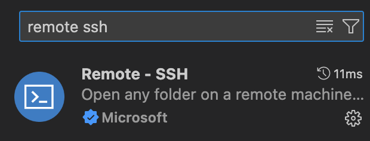
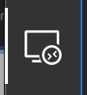
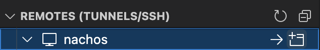

# NTHU Operating Systems Tutorials

## Introduction

Having a nice ssh setting makes connection to server much more easier.
Originally, connecting to server requires the following steps

1. Run ssh command with username and ip address specified

    ```bash
    ssh os23team99@10.121.187.197
    ```

2. Enter password

But with ssh config and authorized_keys, you can connect to the server with just a short command, for example

```bash
ssh nachos
```

Besides, you can also use Visual Studio Code to connect to the server with just a click after configuring ssh config.

## Terminology

- **Client**: The machine you are using to connect to the server, for example your laptop.
- **Server**: The machine you are connecting to, for example the server provided by the course.
- To run a command on the client means to run the command on your PC terminal.
- To run a command on the server means to ssh to the server and run the command on the server terminal.

## SSH Config - To simplify the connection

1. Open terminal (Client)
2. Run the following command to create a new ssh config file and open it (Client)

    ```bash
    # For MacOS
    touch ~/.ssh/config
    open ~/.ssh/config
    # For Windows cmd
    notepad %userprofile%\.ssh\config
    # For Windows powershell
    notepad $env:userprofile\.ssh\config
    ```

3. Add the following content to the file. (Replace `os23team99` with your username) (Client)

    ```bash
    Host nachos
        HostName 10.121.187.197
        user os23team99
    ```

4. Save and close the file
5. Then you can connect to the server with the following command (Client)

    ```bash
    ssh nachos
    ```

## SSH Key - To log in without password

1. Open terminal (Client)
2. Run the following command to generate a new ssh key (Client)

    ```bash
    ssh-keygen
    ```

3. Copy your public key (Client)

    ```bash
    # For MacOS
    ssh-copy-id nachos
    # For Windows cmd
    type %userprofile%\.ssh\id_rsa.pub | ssh nachos "cat >> ~/.ssh/authorized_keys"
    # For Windows powershell
    Get-Content $env:userprofile\.ssh\id_rsa.pub | ssh nachos "cat >> ~/.ssh/authorized_keys"
    ```

4. Now you can connect to the server without entering password (Client)

    ```bash
    ssh nachos
    ```

## Visual Studio Code - To connect to server with just a click

You can choose to use mobaxterm in Windows, but you can also use vscode, a much more convenient choice.

1. Install Remote - SSH extension in vscode [link](https://marketplace.visualstudio.com/items?itemName=ms-vscode-remote.remote-ssh)

    

2. Click on the icon at the left

    

3. Connect to host

    

Congratulations! Now you can connect to the server with just a click.

## Working on Nachos

### Copy Nachos to your user directory

1. Connect to the server
2. Copy the nachos folder to your home directory (Server)

    ```bash
    cp -r /home/os2024/share/NachOS-4.0_MP1 .
    ```

### Open Nachos in Visual Studio Code

1. Connect to the server with vscode
2. Hit `cmd+o` for MacOS or `ctrl+k ctrl+o` for Windows, type `/home/os2023/os23team99/NachOS-4.0_MP1/code` and click ok
3. Now you can edit the nachos code in vscode

### Git

We have already set up git in the NachOS-4.0_MP1 folder. It is recommended to use git to manage your code.

Some useful git commands:

- Create a commit

    ```bash
    git add .
    git commit -m "Your commit message"
    ```

- Push your code to the remote repository if you have added your remote repository

    ```bash
    git push
    ```

### Trace Code Tools and Configuration

It is recommended to install the extension [C/C++](https://marketplace.visualstudio.com/items?itemName=ms-vscode.cpptools), and [Makefile tools](https://marketplace.visualstudio.com/items?itemName=ms-vscode.makefile-tools), and set up the file `NachOS-4.0_MP1/code/.vscode/c_cpp_properties.json` (We have already set up this file for you)

```json
{
    "configurations": [
        {
            "name": "Linux",
            "intelliSenseMode": "gcc-x64",
            "includePath": [
                "${workspaceRoot}",
                "${workspaceRoot}/filesys",
                "${workspaceRoot}/lib",
                "${workspaceRoot}/machine",
                "${workspaceRoot}/network",
                "${workspaceRoot}/test",
                "${workspaceRoot}/threads",
                "${workspaceRoot}/userprog"
            ],
            "compilerPath": "/usr/bin/gcc",
            "defines": [
                "FILESYS_STUB", // Comment in MP4
                "RDATA",
                "SIM_FIX",
                "CHANGED",
                "LINUX",
                "x86"
            ],
            "configurationProvider": "ms-vscode.makefile-tools"
        }
    ],
    "version": 4
}
```

This file is used to provide intellisense for vscode, so that you can have code completion and go to definition.

There are also convenient shortcuts to use in vscode.

- [keyboard-shortcuts-macos](https://code.visualstudio.com/shortcuts/keyboard-shortcuts-macos.pdf)
- [keyboard-shortcuts-windows](https://code.visualstudio.com/shortcuts/keyboard-shortcuts-windows.pdf)

### To build and run nachos

Build nachos

```bash
# Build nachos line by line
cd build.linux # code/build.linux
make clean
make -j
# Or run the script in code/test
cd test # code/test
bash ./build_nachos.sh
```

```bash
# Build test programs
cd test # code/test
make clean
make -j
# Example to run a test
../build.linux/nachos -e add
```

## Run Nachos On your local machine with Docker

1. Install Docker [link](https://docs.docker.com/get-docker/)
2. Download `NachOS-4.0_MP1` from your github repository or copy from the server.
3. Run the following command to build the docker image (Client)

    ```bash
    cd NachOS-4.0_MP1
    docker build -t nachos .
    ```

4. Run the following command to start and get into the docker container (Client)

    ```bash
    docker run --rm -v $(pwd):/nachos -it --platform=linux/amd64 nachos
    ```

5. Now you are in the docker container under `code/test`
6. Now you can build and run nachos in the docker container (Docker)

    ```bash
    # Build nachos line by line
    cd ../build.linux # code/build.linux
    make clean
    make -j
    rm -rf nachos.bin && cp nachos nachos.bin # Required to bypass permission issue
    # Or run the script in code/test
    bash ./build_nachos_docker.sh
    ```

    Note: different from the previous way, we use `nachos.bin` to run nachos in the docker container.

7. To run a test program (Docker)

    ```bash
    # Build test programs
    cd test # code/test
    make clean
    make -j
    # Example to run a test
    ../build.linux/nachos.bin -e add
    ```

8. To exit the docker container, run the following command (Docker)

    ```bash
    exit
    ```
